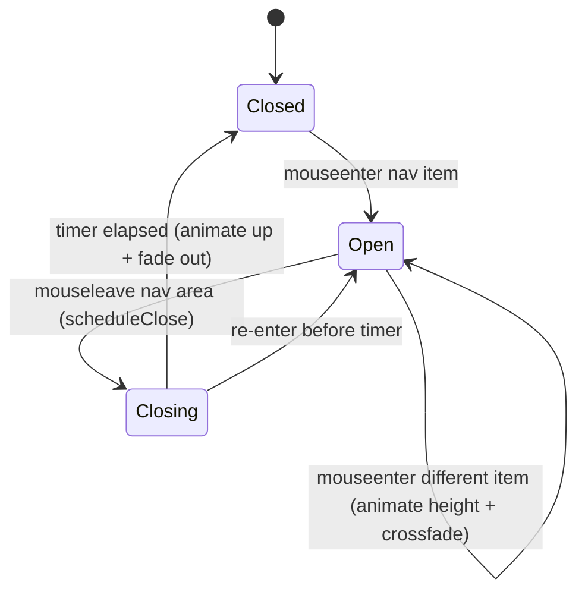

## Background / Context

The desktop top navigation (`src/app/_components/Nav.tsx`) shows a hover "mega-panel" that drops down below the topbar when the user hovers a nav section (Products, Research, Mission, News). The panel and its styling live in `Nav.tsx` and `Nav.module.css`.

Current behavior and its limitations:

- **Open animates, close snaps.** The panel uses `grid-template-rows: 0fr → 1fr` with a `320ms` transition (`.megaPanel` / `.megaPanelOpen`). It animates *down* on open, but on close the content is removed because the panel body is rendered behind `activeSection && (...)`. When `hoveredId` becomes `null`, `activeSection` is `null`, the inner content unmounts immediately, and the height collapses without an elegant *up* animation.
- **No content fade.** Content appears/disappears with the grid-row height change only; there is no opacity cross-fade for the lead/title/blurb/items.
- **Item-to-item height snaps.** Because the open state is `grid-template-rows: 1fr` (intrinsic height), switching from one section to another with different content height changes height instantly — CSS cannot animate between two `auto`/`1fr` heights. Moving from "Products" (3 items) to "Mission" (1 item) jumps.
- **No page blur.** The rest of the page stays fully sharp while the panel is open; there is no focus effect.

This spec covers making the panel animate symmetrically (down on open, up on close), cross-fading its content, dynamically animating its height between sections, and blurring the rest of the page while it is open.



## Goals

- The mega-panel animates *up* (height collapse + fade) on mouse-out symmetrically with the *down* open animation.
- Panel content (lead title, blurb, sub-items) fades in on open and fades out on close, elegantly.
- When moving the cursor from one nav item to another, the panel height animates smoothly between the two content heights (no snap).
- While the panel is open, the rest of the page (the `<main>` content under the topbar) is blurred; the blur is removed (animated) when the panel closes.
- Respect `prefers-reduced-motion`: fall back to instant or opacity-only transitions.
- No regression to the existing mobile drawer (separate code path) or `SectionNav` / `BottomWidget`.

## Non-Goals

- Mobile drawer redesign (the `@media (max-width: 900px)` accordion drawer in `Nav.module.css`) — unchanged.
- Page-to-page route transitions — covered by spec `02`.
- Adding a third-party animation library (e.g. framer-motion). Implement with React state + CSS transitions and a measured-height technique.
- Changing nav information architecture (the `sections` array contents).

## Affected Files & Modules

- `src/app/_components/Nav.tsx` — panel render logic, hover state, height measurement, blur signaling.
- `src/app/_components/Nav.module.css` — `.megaPanel`, `.megaPanelOpen`, `.megaInner`, `.megaLead`, `.megaItems` and new content-fade / height classes.
- `src/app/styles/globals.css` — a global blur utility class applied to `<main>` (or a body-level class) and a `prefers-reduced-motion` guard.
- `src/app/layout.tsx` — only if the blur target needs a stable class/id on `<main>` (e.g. add `id="page-main"` or a className) so Nav can toggle blur on it.

## Interfaces & Signatures

In `Nav.tsx` (client component), introduce explicit state for a render-during-exit + measured height pattern:

```ts
// The section currently displayed in the panel; retained during the exit
// animation so content can fade/animate up before unmounting.
const [displayedSection, setDisplayedSection] = useState<NavSection | null>(null);
const [panelOpen, setPanelOpen] = useState(false);

// Ref to the measured inner content used to drive an explicit pixel height.
const megaContentRef = useRef<HTMLDivElement | null>(null);
const [panelHeight, setPanelHeight] = useState(0); // px; 0 when closed

// Recompute panelHeight when displayedSection changes (and on resize).
function measurePanel(): void; // reads megaContentRef.current?.scrollHeight
```

Blur toggle contract (Nav -> page): toggle a class on the blur target whenever `panelOpen` changes.

```ts
useEffect(() => {
  const main = document.getElementById('page-main'); // set in layout.tsx
  if (!main) return;
  main.classList.toggle('page-blurred', panelOpen);
  return () => main.classList.remove('page-blurred');
}, [panelOpen]);
```

New / changed CSS (conceptual):

```css
/* Drive height explicitly so item-to-item heights animate. */
.megaPanel { height: 0; overflow: hidden; opacity: 0; pointer-events: none;
  transition: height 320ms cubic-bezier(0.4,0,0.2,1), opacity 220ms ease; }
.megaPanelOpen { opacity: 1; pointer-events: auto; } /* inline style sets height */

/* Content cross-fade, independent of height. */
.megaContent { opacity: 0; transition: opacity 200ms ease; }
.megaContentVisible { opacity: 1; }

/* Page blur (globals.css) */
.page-blurred { filter: blur(6px); transition: filter 300ms ease;
  pointer-events: none; user-select: none; }
@media (prefers-reduced-motion: reduce) {
  .megaPanel, .megaContent, .page-blurred { transition-duration: 1ms; }
}
```

## Design / Approach

1. **Render-during-exit.** Replace the inline `activeSection && (...)` gate. Keep `displayedSection` in state. On `openPanel(id)`, set `displayedSection` to that section and `panelOpen = true`. On `scheduleClose` firing, set `panelOpen = false` but keep `displayedSection` until the close transition ends (clear it on `transitionend` of height, or via a timeout matching the duration), so the content can fade/animate up before unmounting.

2. **Measured-height animation.** Switch `.megaPanel` from the `grid-template-rows` trick to an explicit `height` in px set via inline style from `panelHeight`. When `displayedSection` changes, measure `megaContentRef.current.scrollHeight` (in a `useLayoutEffect`) and set `panelHeight`. When closing, set `panelHeight = 0`. Because both endpoints are pixel values, transitions between two different section heights animate smoothly. Add a `ResizeObserver` (or window `resize` listener) to re-measure on viewport changes while open.

3. **Content cross-fade.** Wrap the inner lead+items in a `.megaContent` element that toggles `.megaContentVisible` based on `panelOpen`. Optionally key it by `displayedSection.id` and use a short fade so switching items briefly fades content while height animates.

4. **Page blur.** Add a stable `id="page-main"` (and/or className) to `<main>` in `layout.tsx`. In `Nav.tsx`, an effect toggles `.page-blurred` on that element when `panelOpen` changes. The blur class lives in `globals.css` and animates `filter` over ~300ms. Ensure the topbar/panel themselves are not blurred (they are siblings/ancestors outside `<main>`, so they are unaffected).

5. **Reduced motion.** Under `prefers-reduced-motion: reduce`, collapse transition durations so the experience is instant but functional.

6. **Cleanup.** Ensure timers (`closeTimer`) and observers are cleared on unmount; ensure the blur class is removed on unmount.

## External References

- CSS `grid-template-rows: 0fr → 1fr` height-animation pattern (current approach) and its limitation animating between two non-zero intrinsic heights.
- MDN: `ResizeObserver`, `Element.scrollHeight`, CSS `filter: blur()`, `transition`, `prefers-reduced-motion`.
- React `useLayoutEffect` for synchronous measurement before paint.

## Definition of Done

- Hovering a nav item animates the panel down with content fading in; mousing out of the nav area animates the panel up with content fading out (symmetric, no instant snap).
- Moving directly from one nav item to another animates the panel height between the two sections' heights without a jump, with a content cross-fade.
- While the panel is open, `<main>` content is visibly blurred and unblurs (animated) on close; the topbar and panel are not blurred.
- `prefers-reduced-motion: reduce` disables/【shortens transitions without breaking open/close.
- The mobile drawer, `SectionNav`, and `BottomWidget` are unchanged in behavior.
- `npm run build` and `npm run typecheck` pass with no new errors.
</markdown_contents>
</invoke>
